# AutoSOC architecture

AutoSOC separates evidence-producing security logic from advisory agent logic.
The deterministic tier owns parsing, detection, ATT&CK mapping, confidence, risk,
and threat-intelligence provenance. The LangGraph tier can prioritize only those
validated facts and cannot create findings, indicators, mappings, or executable
actions.

The standalone diagram source is available in
[`architecture.mermaid`](architecture.mermaid).

```mermaid
flowchart TB
    subgraph INPUT["Untrusted input"]
        JSON["JSON / JSONL logs"]
        ACCESS["Apache / Nginx access logs"]
    end

    subgraph TIER1["Tier 1 — Deterministic ingestion, detection, and enrichment"]
        PARSER["Normalize and validate\nSecurityEvent"]
        SQLI["SQLi rules\nURL decode + regex"]
        TLS["Weak-TLS rules\nprotocol and cipher deny-lists"]
        FINDING["DetectionFinding\nevidence + confidence + ATT&CK"]
        BASE["Transparent base score\nseverity + confidence"]
        ABUSEGATE{"AbuseIPDB eligible?\nglobal unicast + API key"}
        GREYGATE{"GreyNoise eligible?\nglobal IPv4 + API key"}
        ABUSE["AbuseIPDB check\nasync httpx client"]
        GREY["GreyNoise Community check\nasync httpx client"]
        NEUTRAL["Labeled neutral result\noffline / no key / ineligible / failure"]
        GREYPOLICY{"Live GreyNoise context\nbenign or unknown noise?"}
        REDUCE["Retain 25% of subtotal\nvisible 75% reduction"]
        PRESERVE["No GreyNoise reduction\nmalicious overrides noise"]
        RESCORE["Deterministic re-score\nreputation + noise filter"]
        REPORT["Validated IncidentReport\ndecision trace + provenance"]
    end

    subgraph TIER2["Tier 2 — LangGraph agent workflow"]
        START((START))
        STATE["AgentState\nreport + messages + playbook"]
        TRIAGE["Triage node\nprioritize existing findings"]
        INTEL["Intel node\nreview TI provenance + ATT&CK"]
        RESPONSE["Response node\nselect response focus"]
        END((END))
    end

    subgraph GUARDS["Grounding and availability guardrails"]
        PACKET["Bounded fact packet\nraw_log excluded"]
        SELECT["Schema + allow-list validation\nIDs, IPs, mappings, enums only"]
        LLM["Optional ChatOpenAI\nfact selection only"]
        LOCAL["Deterministic local fallback"]
        RENDER["Deterministic Python renderer\ncommands are not model-authored"]
    end

    subgraph APPROVAL["Human-in-the-loop boundary"]
        PLAYBOOK["DRY RUN / PREVIEW ONLY\nPENDING HUMAN APPROVAL"]
        HUMAN{"Named human approver\nvalidates scope and impact"}
        APPROVALAPI["POST /api/execute-playbook\nvalidated approval receipt"]
        TARGETS["Re-derive firewall targets\nnormalized unicast SQLi IPs only"]
        ARTIFACT["0600 comment-only artifact\nAUTOSOC_DATA_DIR/remediation"]
        EXTERNAL["Manual inspection and change workflow\noutside AutoSOC"]
        REJECT["Reject, revise, or monitor"]
    end

    JSON --> PARSER
    ACCESS --> PARSER
    PARSER --> SQLI
    PARSER --> TLS
    SQLI --> FINDING
    TLS --> FINDING
    FINDING --> BASE
    BASE --> ABUSEGATE
    BASE --> GREYGATE
    ABUSEGATE -- "yes" --> ABUSE
    ABUSEGATE -- "no" --> NEUTRAL
    GREYGATE -- "yes" --> GREY
    GREYGATE -- "no" --> NEUTRAL
    GREY --> GREYPOLICY
    GREYPOLICY -- "yes" --> REDUCE
    GREYPOLICY -- "malicious / other" --> PRESERVE
    ABUSE --> RESCORE
    ABUSE -. "request / validation failure" .-> NEUTRAL
    GREY -. "request / validation failure" .-> NEUTRAL
    NEUTRAL --> RESCORE
    REDUCE --> RESCORE
    PRESERVE --> RESCORE
    RESCORE --> REPORT
    PARSER -. "zero findings" .-> REPORT

    REPORT --> STATE
    STATE -. "initializes and receives updates" .-> START
    START --> TRIAGE --> INTEL --> RESPONSE --> END
    STATE -. "validated report" .-> TRIAGE
    STATE -. "reduced messages" .-> INTEL
    STATE -. "report + prior context" .-> RESPONSE
    REPORT --> PACKET
    PACKET --> TRIAGE
    PACKET --> INTEL
    PACKET --> RESPONSE
    LLM --> SELECT
    LOCAL --> SELECT
    SELECT --> TRIAGE
    SELECT --> INTEL
    SELECT --> RESPONSE
    RESPONSE -. "invokes inside node" .-> RENDER

    RENDER --> PLAYBOOK --> HUMAN
    HUMAN -- "approved for artifact generation" --> APPROVALAPI
    APPROVALAPI --> TARGETS --> ARTIFACT
    ARTIFACT -. "never executed by AutoSOC" .-> EXTERNAL
    HUMAN -- "not approved" --> REJECT

    classDef deterministic fill:#dff7e5,stroke:#207a3c,color:#102a18,stroke-width:2px;
    classDef agent fill:#e7efff,stroke:#2855a5,color:#102044,stroke-width:2px;
    classDef guard fill:#fff3cd,stroke:#9a6b00,color:#3b2b00,stroke-width:2px;
    classDef danger fill:#fde2e2,stroke:#a61b1b,color:#4a0d0d,stroke-width:2px;
    classDef external fill:#f2e8ff,stroke:#7040a0,color:#2c1742,stroke-width:2px;

    class PARSER,SQLI,TLS,FINDING,BASE,ABUSEGATE,GREYGATE,ABUSE,GREY,NEUTRAL,GREYPOLICY,REDUCE,PRESERVE,RESCORE,REPORT deterministic;
    class START,STATE,TRIAGE,INTEL,RESPONSE,END agent;
    class PACKET,SELECT,LLM,LOCAL,RENDER,APPROVALAPI guard;
    class TARGETS deterministic;
    class PLAYBOOK,HUMAN,ARTIFACT,REJECT danger;
    class EXTERNAL external;
```



## Trust boundaries

### Boundary 1: untrusted logs to validated events

The JSON and Apache/Nginx parsers treat every input field as untrusted. They
normalize supported aliases, validate IP addresses, ports, timestamps, and event
types through Pydantic, and preserve the original record for the audit report.
Malformed records fail with a parser error instead of being partially accepted.

The normalized [`SecurityEvent`](../src/autosoc/models.py) is the only event
contract consumed by detectors.

### Boundary 2: deterministic facts to advisory agents

The compiled graph receives one validated `IncidentReport`. Before any optional
model call, each node constructs a bounded fact packet. The packet excludes
`raw_log` and includes only the facts appropriate to that role.

ChatOpenAI is not asked to write prose or shell commands. It may return only a
strict `AgentSelection` containing allow-listed values copied from the fact
packet:

- finding UUIDs;
- evidence UUIDs;
- ATT&CK technique IDs already present in the report;
- exact report IP addresses; and
- predefined response-focus enums.

Unknown identifiers, extra fields, prose, URLs, commands, or unsupported focus
values invalidate the selection. The node then uses the same deterministic local
fallback used in offline mode. Python renders every message and playbook section.

### Boundary 3: playbook to infrastructure

The Response node ends at a preview. A named human must validate the asset,
evidence, business impact, target scope, change ticket, and rollback before
submitting `POST /api/execute-playbook`. The endpoint records approval for
artifact generation only; it does not authorize or execute a host change.

The server revalidates the submitted `IncidentReport`, requires its `report_id`
to match the separately supplied report ID, and accepts only the literal JSON
boolean `approval_confirmed: true`, a bounded approver identity, and an optional
single-line approval reason. It then derives targets again from normalized events
backed by deterministic SQL-injection findings. Agent text and command previews
are never inputs to this derivation.

Normalized unicast source IPs are eligible, including private enterprise ranges
and RFC documentation ranges. Loopback, link-local, multicast, and unspecified
or reserved non-host sources are withheld; TLS-only reports are also ineligible.
The bounded target set is written atomically to
`AUTOSOC_DATA_DIR/remediation/firewall_remediation.sh`. Every line in that file
is a shell comment, its mode is `0600`, and it has no executable bit. Symlinked
directories or targets fail closed.

The `201 Created` response is an explicit approval receipt containing the report
and receipt IDs, approver, approval time, approved targets, relative artifact
path, SHA-256 digest, byte size, replacement status, `executed: false`, and a
safety notice. AutoSOC still has no firewall execution edge, firewall capability,
AWS credentials, or subprocess call in this workflow. Inspection, change-control
authorization, command extraction, and execution remain outside AutoSOC.

## Tier 1: deterministic pipeline

| Stage | Implementation | Auditable output |
| --- | --- | --- |
| Ingestion | `parsers/log_parser.py` | Validated `SecurityEvent`, parser name, source, raw record, and normalization warnings |
| SQLi detection | `detectors/sqli.py` | URL-decoded evidence, exact regex match offsets, confidence, `T1190`, and trace entries |
| TLS detection | `detectors/weak_tls.py` | Canonical deprecated protocol or exact weak-cipher evidence; no speculative ATT&CK mapping |
| Base scoring | `scoring/risk.py` | Versioned severity baseline and confidence adjustment |
| AbuseIPDB enrichment | `integrations/abuseipdb.py` | Live or mock provenance, score, country, usage type, retrieval reason, and timestamp |
| GreyNoise enrichment | `integrations/greynoise.py` | Live or neutral provenance, scanner/RIOT flags, classification, lookup status, and timestamp |
| Re-scoring | `cli.py` | Bounded reputation points, an explicit GreyNoise adjustment, provider evidence, and a new scoring trace entry |
| Aggregation | `cli.py` and `models.py` | Integrity-checked `IncidentReport` with complete evidence and decision trace |

Formula version 1.1 remains additive and clamped:

```text
subtotal = clamp(severity_baseline + confidence_adjustment + ip_reputation, 0, 100)
score = clamp(subtotal + greynoise_noise_filter, 0, 100)
```

IP reputation contributes at most 20 points. A missing reputation value is
neutral rather than assumed malicious. For an eligible GreyNoise result, the
filter contribution is `round_half_up(subtotal × 0.25) - subtotal`: 25% of the
score is retained and 75% is removed. The negative contribution and its
GreyNoise evidence ID remain visible in the finding.

GreyNoise reduction requires an authoritative, live, matched result and one of
these exact conditions:

- `classification=benign`; or
- `noise=true` with `classification=unknown`.

`noise=true` means observed scanner activity, not proof that the actor is safe.
Consequently, `classification=malicious` overrides the noise filter and adds a
visible zero-point contribution instead of reducing risk. Mock, offline,
missing-key, non-global, invalid, failed, and not-found results are neutral and
cannot lower a score. GreyNoise changes queue priority only; it never deletes or
modifies a deterministic finding. This distinction follows GreyNoise's official
[Community response semantics](https://docs.greynoise.io/docs/community-response).

## Tier 2: LangGraph workflow

The state contract contains exactly:

- `incident_report: IncidentReport`;
- `messages: Annotated[list[AnyMessage], add_messages]`; and
- `playbook: str`.

The graph is deliberately linear and easy to audit:

```text
START → triage_node → intel_node → response_node → END
```

| Node | Responsibility | Authority limit |
| --- | --- | --- |
| Triage | Order validated findings and summarize observed attack vectors | Cannot alter findings, scores, evidence, or mappings |
| Intel | Explain AbuseIPDB and GreyNoise provenance plus existing ATT&CK context | Mock data is labeled non-authoritative; no mapping or actor attribution is inferred |
| Response | Select response focus and request a deterministic playbook | Cannot author commands or execute actions |

The CLI streams node-level `updates` so an operator sees the report summary,
Triage update, Intel update, Response update, and final playbook in order.

## Offline and failure behavior

| Condition | Threat intelligence | Agent workflow |
| --- | --- | --- |
| `--offline` | Immediate neutral results from both providers; no HTTP client request | Deterministic local nodes; no OpenAI request |
| Missing AbuseIPDB key | Mock result labeled `API key is unavailable` | Unaffected |
| Missing `GREYNOISE_API_KEY` | Neutral result labeled `GreyNoise API key is unavailable`; no request | Unaffected |
| Private, reserved, or special-use IP | Immediate neutral results; address is never sent externally | Indicator remains available as report context but is ineligible for the agent playbook's executable-looking firewall preview; the separately approved inert artifact uses the normalized-unicast policy below |
| Global IPv6 source | AbuseIPDB may remain eligible; GreyNoise Community returns a neutral non-global result because this client permits only global IPv4 | Unaffected |
| AbuseIPDB timeout, HTTP error, or invalid JSON | Mock result labeled as request/validation failure | Unaffected |
| GreyNoise timeout, HTTP error, or invalid response | Neutral result labeled as request/validation failure | Unaffected |
| Missing OpenAI key | Unaffected | Lazy client construction is skipped; deterministic fallback |
| Model error or invalid selection | Unaffected | Provider failure is suppressed and the deterministic fallback completes the graph |
| No findings | Neither enrichment provider is queried | No containment command; preserve and monitor |

All fallbacks still produce a valid report and playbook. They reduce external
context, not deterministic detection coverage.

## Ground-truth and ATT&CK enforcement

Every `DetectionFinding` must contain evidence, a confidence basis, visible risk
components, and a contiguous decision trace. Mappings are aggregated from
findings into the report and Pydantic rejects any mismatch.

The SQLi detector assigns `T1190` (Exploit Public-Facing Application) because a
crafted application exploit attempt is directly observed. Weak TLS findings do
not receive a technique merely to populate the field: a deprecated protocol or
cipher is configuration evidence, not proof of sniffing, downgrade, or
adversary-in-the-middle activity.

## Containment guardrails

The generated playbook always states:

- `DRY RUN / RECOMMENDATION ONLY`;
- `PENDING HUMAN APPROVAL`; and
- `No action has been executed`.

Network command previews have additional constraints:

1. The source must belong to a SQLi finding.
2. The IP must be globally routable unicast—not private or special-use.
3. Targets are deduplicated and capped.
4. The non-mutating `iptables -C` check is shown separately from the proposed
   `iptables -I` mutation.
5. The rule contains an `AutoSOC:<report-id>` comment.
6. Rollback removes only that exact tagged rule with `iptables -D`.

AWS Security Groups are correctly treated as allow-lists, not deny-lists. The
playbook first previews the current rules and then shows an exact rule revocation
with `--dry-run`. Required shell values use `${NAME:?set NAME}` so an unset target
fails closed.

### Approval receipt and remediation artifact

The dashboard's **Approve & Execute** label means “record approval and generate
an artifact”; it never means “execute a firewall command.” The browser submits:

- the validated `incident_report` returned by orchestration;
- the same `report_id` as an explicit binding value;
- the literal boolean `approval_confirmed: true`;
- a bounded `approved_by` identity; and
- an optional bounded, single-line `approval_reason`.

`POST /api/execute-playbook` returns `201 Created` only after it safely writes
the artifact. Its receipt has `status: artifact_generated` and
`executed: false`, plus the receipt ID, approval metadata, exact target list,
artifact SHA-256, size, fixed relative path, mode `0600`, inert-command flag, and
whether a prior regular artifact was atomically replaced.

The remediation module does not parse the generated playbook. It independently
selects normalized unicast source IPs associated with deterministic SQLi
findings, rejects loopback/link-local/multicast/unspecified and reserved non-host
addresses,
deduplicates and sorts the remainder, and fails rather than
silently truncating a report above its 50-target limit. The generated
`firewall_remediation.sh` contains only commented `iptables` or `ip6tables`
proposals and commented rollback lines. AutoSOC never invokes the shell, changes
file mode to executable, or modifies firewall state.

## Container deployment boundary

The checked-in `Dockerfile` uses separate Python 3.12 slim builder and runtime
stages. The runtime process runs as the non-root `autosoc` user and exposes only
port 8000. Docker Compose adds a read-only root filesystem, drops every Linux
capability, enables `no-new-privileges`, bounds process count and logs, supplies a
`noexec` temporary filesystem, and health-checks `GET /healthz`.

`./data` is the only persistent writable bind mount and appears inside the
container as `/app/data`; Compose sets `AUTOSOC_DATA_DIR=/app/data`. This mount
supports both log ingestion and the fixed
`remediation/firewall_remediation.sh` artifact. `AUTOSOC_UID` and `AUTOSOC_GID`
must match the host account that owns `./data`, especially on native Linux, so
the non-root process can create the remediation directory without producing
unexpected root-owned files.

Live providers remain fail-closed in containers. The Compose default is
`AUTOSOC_ENABLE_LIVE_PROVIDERS=false`, so API keys alone cannot enable outbound
provider calls from the web dashboard. Enabling live web providers also requires
a dashboard password of at least 16 characters; public deployments should retain
authentication, an exact `AUTOSOC_ALLOWED_HOSTS` list, and a nonzero request
budget.

## Sample validation path

[`data/samples/attack_simulation.json`](../data/samples/attack_simulation.json)
contains 12 newline-delimited JSON events:

- two `UNION SELECT` attempts, including URL encoding;
- two boolean-inference attempts, including double encoding;
- SSLv3 and TLS 1.0 handshakes;
- one RC4/MD5 weak cipher; and
- five benign web/network baselines.

The expected offline result is seven findings, five benign records with zero
findings, risk 65/100, 14 neutral mocked enrichment records across the two
providers, and one aggregated ATT&CK technique: `T1190`.
