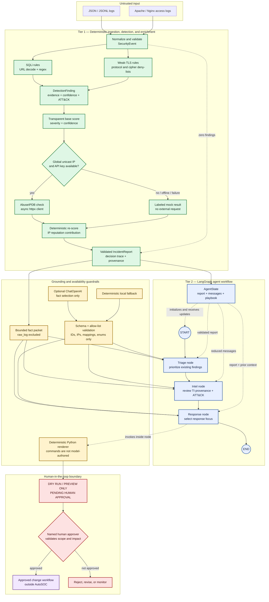

# AutoSOC architecture

AutoSOC separates evidence-producing security logic from advisory agent logic.
The deterministic tier owns parsing, detection, ATT&CK mapping, confidence, risk,
and threat-intelligence provenance. The LangGraph tier can prioritize only those
validated facts and cannot create findings, indicators, mappings, or executable
actions.

The standalone diagram source is available in
[`architecture.mermaid`](architecture.mermaid).



## Trust boundaries

### Boundary 1: untrusted logs to validated events

The JSON and Apache/Nginx parsers treat every input field as untrusted. They
normalize supported aliases, validate IP addresses, ports, timestamps, and event
types through Pydantic, and preserve the original record for the audit report.
Malformed records fail with a parser error instead of being partially accepted.

The normalized [`SecurityEvent`](../src/autosoc/models.py) is the only event
contract consumed by detectors.

### Boundary 2: deterministic facts to advisory agents

The compiled graph receives one validated `IncidentReport`. Before any optional
model call, each node constructs a bounded fact packet. The packet excludes
`raw_log` and includes only the facts appropriate to that role.

ChatOpenAI is not asked to write prose or shell commands. It may return only a
strict `AgentSelection` containing allow-listed values copied from the fact
packet:

- finding UUIDs;
- evidence UUIDs;
- ATT&CK technique IDs already present in the report;
- exact report IP addresses; and
- predefined response-focus enums.

Unknown identifiers, extra fields, prose, URLs, commands, or unsupported focus
values invalidate the selection. The node then uses the same deterministic local
fallback used in offline mode. Python renders every message and playbook section.

### Boundary 3: playbook to infrastructure

The Response node ends at a preview. AutoSOC has no command-execution edge,
firewall tool, AWS credentials, or approval API. A named human must validate the
asset, evidence, business impact, exact command, change ticket, and rollback
before moving an action into an external change process.

## Tier 1: deterministic pipeline

| Stage | Implementation | Auditable output |
| --- | --- | --- |
| Ingestion | `parsers/log_parser.py` | Validated `SecurityEvent`, parser name, source, raw record, and normalization warnings |
| SQLi detection | `detectors/sqli.py` | URL-decoded evidence, exact regex match offsets, confidence, `T1190`, and trace entries |
| TLS detection | `detectors/weak_tls.py` | Canonical deprecated protocol or exact weak-cipher evidence; no speculative ATT&CK mapping |
| Base scoring | `scoring/risk.py` | Versioned severity baseline and confidence adjustment |
| Enrichment | `integrations/abuseipdb.py` | Live or mock provenance, score, country, usage type, retrieval reason, and timestamp |
| Re-scoring | `cli.py` | A bounded IP-reputation contribution and a new scoring trace entry |
| Aggregation | `cli.py` and `models.py` | Integrity-checked `IncidentReport` with complete evidence and decision trace |

The risk formula is additive and clamped:

```text
score = clamp(severity_baseline + confidence_adjustment + ip_reputation, 0, 100)
```

IP reputation contributes at most 20 points. A missing reputation value is
neutral rather than assumed malicious.

## Tier 2: LangGraph workflow

The state contract contains exactly:

- `incident_report: IncidentReport`;
- `messages: Annotated[list[AnyMessage], add_messages]`; and
- `playbook: str`.

The graph is deliberately linear and easy to audit:

```text
START → triage_node → intel_node → response_node → END
```

| Node | Responsibility | Authority limit |
| --- | --- | --- |
| Triage | Order validated findings and summarize observed attack vectors | Cannot alter findings, scores, evidence, or mappings |
| Intel | Explain AbuseIPDB provenance and existing ATT&CK context | Mock data is labeled non-authoritative; no mapping is inferred |
| Response | Select response focus and request a deterministic playbook | Cannot author commands or execute actions |

The CLI streams node-level `updates` so an operator sees the report summary,
Triage update, Intel update, Response update, and final playbook in order.

## Offline and failure behavior

| Condition | Threat intelligence | Agent workflow |
| --- | --- | --- |
| `--offline` | Immediate mock result; no HTTP client request | Deterministic local nodes; no OpenAI request |
| Missing AbuseIPDB key | Mock result labeled `API key is unavailable` | Unaffected |
| Private, reserved, or special-use IP | Immediate mock result; address is never sent externally | Indicator remains available as report context but is ineligible for a firewall preview |
| AbuseIPDB timeout, HTTP error, or invalid JSON | Mock result labeled as request/validation failure | Unaffected |
| Missing OpenAI key | Unaffected | Lazy client construction is skipped; deterministic fallback |
| Model error or invalid selection | Unaffected | Provider failure is suppressed and the deterministic fallback completes the graph |
| No findings | No enrichment request | No containment command; preserve and monitor |

All fallbacks still produce a valid report and playbook. They reduce external
context, not deterministic detection coverage.

## Ground-truth and ATT&CK enforcement

Every `DetectionFinding` must contain evidence, a confidence basis, visible risk
components, and a contiguous decision trace. Mappings are aggregated from
findings into the report and Pydantic rejects any mismatch.

The SQLi detector assigns `T1190` (Exploit Public-Facing Application) because a
crafted application exploit attempt is directly observed. Weak TLS findings do
not receive a technique merely to populate the field: a deprecated protocol or
cipher is configuration evidence, not proof of sniffing, downgrade, or
adversary-in-the-middle activity.

## Containment guardrails

The generated playbook always states:

- `DRY RUN / RECOMMENDATION ONLY`;
- `PENDING HUMAN APPROVAL`; and
- `No action has been executed`.

Network command previews have additional constraints:

1. The source must belong to a SQLi finding.
2. The IP must be globally routable unicast—not private or special-use.
3. Targets are deduplicated and capped.
4. The non-mutating `iptables -C` check is shown separately from the proposed
   `iptables -I` mutation.
5. The rule contains an `AutoSOC:<report-id>` comment.
6. Rollback removes only that exact tagged rule with `iptables -D`.

AWS Security Groups are correctly treated as allow-lists, not deny-lists. The
playbook first previews the current rules and then shows an exact rule revocation
with `--dry-run`. Required shell values use `${NAME:?set NAME}` so an unset target
fails closed.

## Sample validation path

[`data/samples/attack_simulation.json`](../data/samples/attack_simulation.json)
contains 12 newline-delimited JSON events:

- two `UNION SELECT` attempts, including URL encoding;
- two boolean-inference attempts, including double encoding;
- SSLv3 and TLS 1.0 handshakes;
- one RC4/MD5 weak cipher; and
- five benign web/network baselines.

The expected offline result is seven findings, five benign records with zero
findings, risk 65/100, and one aggregated ATT&CK technique: `T1190`.
